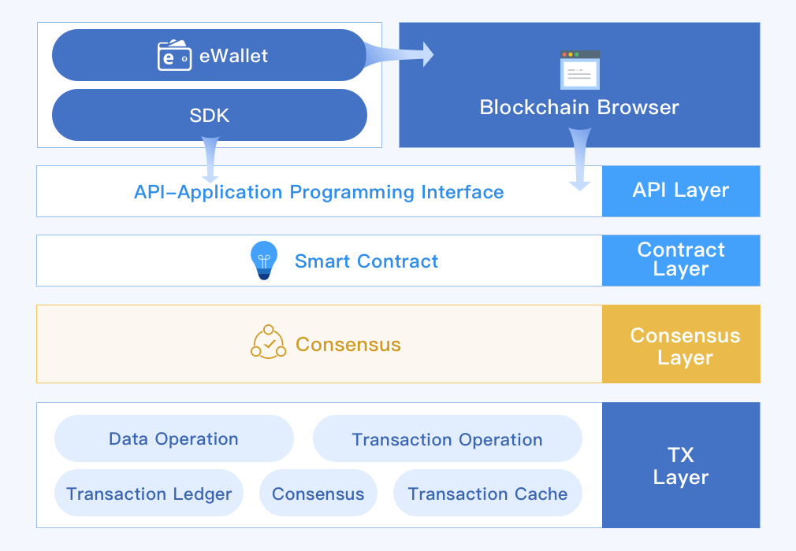

# Security strategy !heading

As we all know, the development of blockchain technology is inseparable from cryptography, but this does not mean that we can use the blockchain at will without worrying about security issues.

Around the blockchain-based banking business system, security policies are required from the underlying blockchain (smart contracts) and application systems, and they are strictly enforced.

## Blockchain security

The blockchain is essentially a system based on how to ensure that the data is trusted in an insecure and untrusted environment. Transactions are undeniable through transaction signatures. Ledgers are accessed through block connections, P2P network communication synchronization, and consensus algorithms. Ensure the consistency of the ledger data.

The wallet on blockchain has two parts, the address and the secret. For the user, the secret must be ensured and it cannot be leaked to third parties.

When transferring assets, you should use the wallet secret to sign the transaction locally or offline, and then send it to the blockchain node. Do not transmit the key on the network.

For long-term custody assets, transfer them to a cold wallet. Once the cold wallet transfers assets, it becomes a hot wallet, and a new cold wallet can be established to save the remaining assets.

For the transfer of major assets, you can vote by multi-signature wallet to prevent the risk of a single wallet.

## Business system security

Traditional security technologies are still effective for blockchain application systems, such as establishing a DMZ and deploying blockchain node services between two firewalls to prevent sniffing and intrusion from public networks.

The application system will inevitably use the wallet secret for transaction signing, and should pay attention to the following:

1. Do not save secret on any server
1. If needs a transaction signature on server,  It can transmit the transaction details to a dedicated server for one-way signature, and then retrieve the signed content for broadcasting.
1. The user's wallet secret should be stored on the client, and the user is responsible for backing it up, not on the server
1. If the user secret must be stored on the server, it must be stored after encrypted secret, preferably user password, salt double encryption
