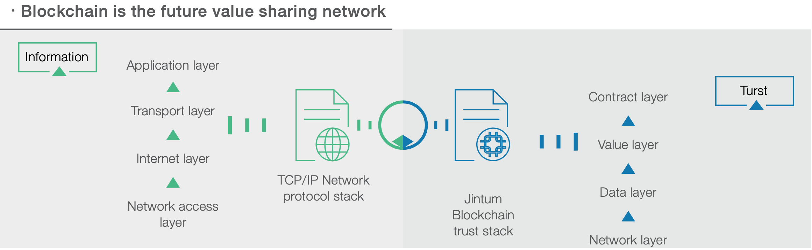
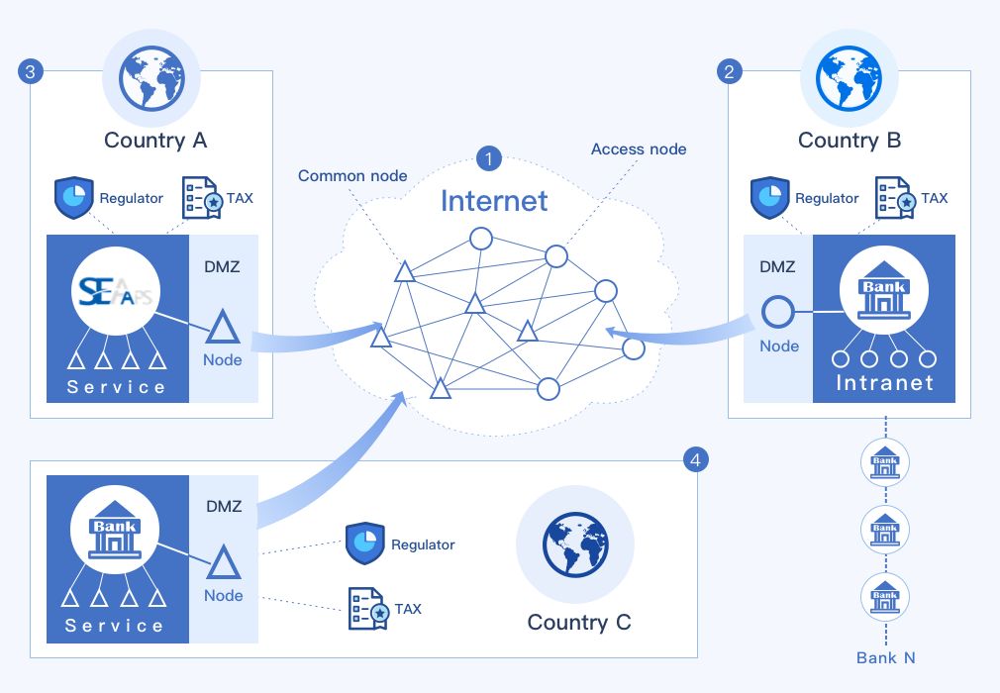
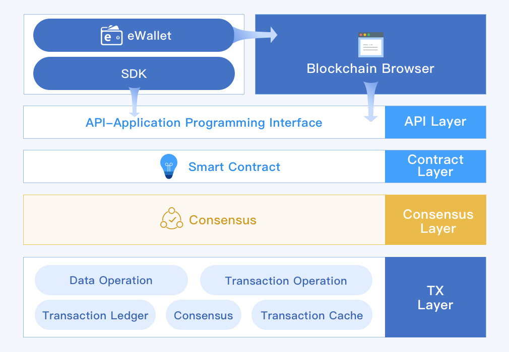
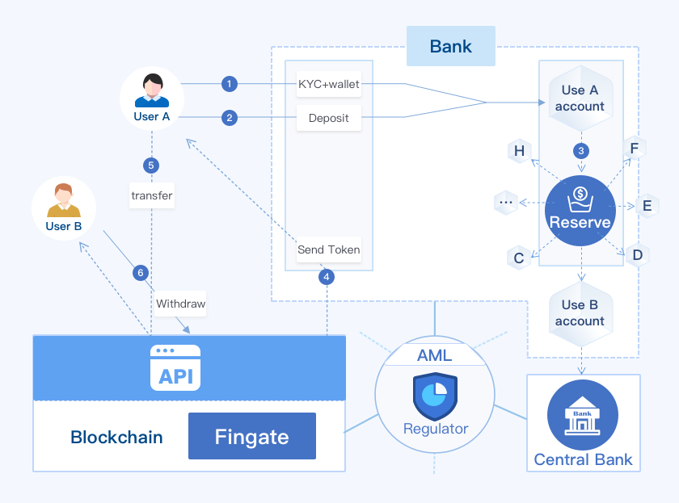
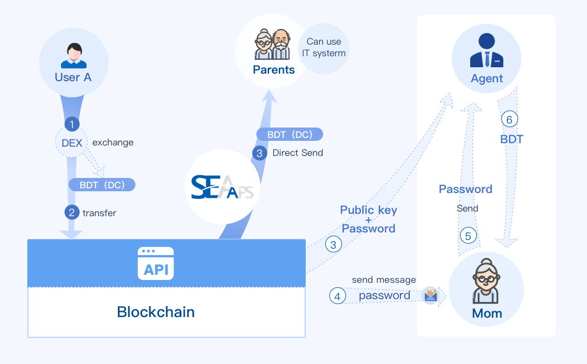

# 目录

* [前言](#前言)
* [SEAAPS区块链](#seaaps区块链)
* [系统架构](#系统架构)
* [软件系统架构](#软件系统架构)
* [安全策略](#安全策略)

# 前言

当前区块链和产业的拥抱越来越快，各种应用层出不穷，不再是社区中的极客玩具，而是各行各业探索和实践区块链技术如何在产业中应用。

本手册针对金融行业的特点，阐述SEAAPS区块链如何部署，和金融行业现有系统如何对接，基于区块链技术的银行业务在现在和未来如何部署和实施。

# SEAAPS区块链

在2011年，比特币出现方兴未时，SEAAPS的创业团队就将比特币的底层技术“区块链”作为未来改变人类社会组织方式的新兴技术进行研究，并在2014年完成了SEAAPS公链上线运行。

SEAAPS设计的目标和愿景是提供安全、真实、可信的商用区块链环境。同时，SEAAPS公链的定位同时也是一个容纳各种数字化资产的去中心化的交易平台。

区块链第一次使得多方共同信任相同的数据源成为可能，并允许多方互相传递数字资产而不需要担心“双重消费”问题，大大降低了多方互信的成本，并进一步促进了多方之间的低成本的价值共享。

SEAAPS区块链是信任机器。

主流区块链技术功能对比

项目|比特币|以太坊|超级账本|瑞波/恒星|SEAAPS
:--:|:--:|:--:|:--:|:--:|:--:
共识机制|PoW|PoW|插件式|Consensus|RBFT
多资产支持|N|合约|合约|原生|原生
资产交换|N|合约|合约|原生|原生
智能合约|N|Y|Y|N|Y
系统性能|弱|弱|好|一般|好
节点数量|很多|较多|无公链|一般|一般

# 系统架构

金融行业的区块链，不是公链，必须满足金融监管要求，因此在系统架构上就要充分考虑这个要求，本章节阐述满足金融业务的区块链系统架构应该注意的事项。

## 系统架构总览

* 区域1：区块链网络，也是构建在互联网之上的一个虚拟网络
* 区域2/3/4：区块链网络中的节点区域，可以是单独的节点，也可以是节点和业务应用的混合区域；
  * DMZ：Dmilitarized zone,隔离区或者称为非军事化区域，位于两个防火墙之间，通常建议在这个区域部署区块链节点服务，连接区块链网络和内部业务网络；
  * SEAAPS: SEAAPS为区块链提供基础服务的应用，例如区块链浏览器，预言机服务；
  * Intranet/Service: 业务应用服务，是银行自己内部业务系统，例如银行账户系统，KYC服务等；
  * Regulator: 行业监管机构，对交易进行监管，满足反洗钱(AML)管理需要；
  * TAX: 税务监管机构；
* 三角形：代表区块链的共识节点，通常是联盟链管理机构进行选举指定的记账节点；
* 圆形：接入节点，联盟链许可接入的节点，没有记账权的节点

## 节点

SEAAPS区块链是由多个参与方的节点互相连接起来的一个虚拟的网络，网络中的每个参与方可以有一个或者多个节点，他们以网络服务的形式存在，每个节点都维护全部或者部分账本数据，整个区块链网络中账本数据有多个副本，因此单个或者部分节点失能，不会丢失数据，不会停止服务。

SEAAPS区块链的共识采用RANDOMIZED BFT的方式。SEAAPS区块链的核心有若干个验证节点维持系统的基本验证网络。SEAAPS区块链的验证网络对每一个接入SEAAPS区块链的应用开放。接入SEAAPS区块链的应用是指以SEAAPS区块链为平台的针对某些用户的应用程序。这些应用可以通过SEAAPS区块链提供的API直接接入SEAAPS区块链的公有区块链。这些应用可以起到一个验证节点的作用。

这样的节点可以实现两个功能:

1. 参与SEAAPS区块链网络的公共节点验证，实现应用接入SEAAPS区块链网络。
2. 如果应用只是仅仅使用API访问所需的区块链功能，则并不需要部署一个单独的验证节点，部署一个接入节点即可。

RBFT算法有三分之一的容错率，验证节点数量建议不低于6个节点。

## 共识算法

SEAAPS区块链技术采用自有知识产权的随机BFT共识算法。

RBFT的这个机制下有一个叫View的概念，在一个View 里，一个节点(REPLICA)会是主节点(PRIMARY)，其余的节点都叫备份节点(BACKUPS)。主节点负责将来自客户端的请求给排好序，然后按序发送给备份节点们。RBFT的这个主节点拥有比其它节点更加大的权利，如果它出现问题，会导致系统中比较大的延迟。在RBFT中，对这一点进行了改进，参考了RAFT中选举的机制，采用投票表决方式，无需抢夺记账权，保证各个节点权益的公平性。

## 金融区块链

金融区块链是一个联盟链，也是一个许可链。

金融区块链由金融行业中的企业构成的一个网络，通过这个网络来运行各种金融业务，其交易数据信息只有联盟内的成员才有资格查看，因此需要联盟成员进行批准才能接入联盟链。

监管部门（包括所在国税务机构）作为其中一个节点成员对交易实时监管，以满足反洗钱监管和其他业务监管要求，如果发生违反监管的交易，可以通过联盟链的治理机制对相关交易人钱包实施冻结，防止造成更大的违法后果。

# 软件系统架构

区块链和金融业务实际结合，在软件架构层面和传统的中心化系统不一样，本章节不仅通过架构来说明，针对不同场景应用，也有设计说明。

## 软件架构

金融应用的软件架构如下图：

作为应用，例如(eWallet)，是通过集成SDK获得访问区块链服务的能力。在API以下区域，可以视为一个区块链节点服务，整个区块链网络中有很多这样的节点，应用可以选择任意一个节点，都可以运行。

区块链的设计是围绕账本可信的目的展开的，因此对交易的统计归类以及查询来说，区块链的API是低效的，通常情况下这个职责由浏览器服务来担任。

## 支付

作为银行来说，使用区块链进行支付，需要将真实的资金和区块链上流通的通证进行映射，业务框架图如下：

1. 用户（公司）注册区块链钱包，并在银行完成KYC，和用户在银行的账户进行绑定
1. 用户（公司）充值货币到银行，
1. 银行收到后，将用户银行账户的相应资金转移到托管的资金池账户
1. 银行接着将DC转移到用户的钱包中
1. 用户自己可以直接将DC支付给另外一个用户钱包
1. 用户B需要提现成货币到自己银行账户的话，在区块链上发起提现流程，将资金转移到银行的钱包中(Fingate)
1. 银行监视到资金变化后，根据交易请求，将资金池里面的资金划拨到用户B的银行账户中
1. 在区块链上的支付活动受到监管节点的监视，满足反洗钱（AML）的监管要求，因为每个钱包都是做了KYC的。

图中的资金池的资金是在区块链上流通的资产通证的总和，两边的数量完全一致。

## 汇兑

对于汇兑业务，基于区块链的流程如下：

对于会使用手机APP的用户来说，接收到通证后，直接用APP进行支付，或者在将通证通过银行银关提现到自己的银行账户。

对于没有银行账户的用户来说，汇款人可以用双重加密方式进行汇款。

1. 汇款人将通证转账到离接收人最近的取款点钱包中，备注用取款点钱包地址加上汇款人指定的密码进行双重加密；
1. 汇款人将密码通过短信、电话等其他方式告知接收人；
1. 接收人到取款点，告知密码，取款点用只有自己知道的钱包密钥和密码进行解密，得到备注明文信息，核对接收人身份后，付款；

# 安全策略

众所周知，区块链技术的诞生和发展的过程，和密码学密不可分，然而这并不意味着我们可以随心所欲的使用区块链而不用担心安全问题。

围绕基于区块链的银行业务系统，从底层区块链(智能合约)、应用系统都需要安全策略，并严格的执行。

## 区块链安全

区块链本质上是基于在一个不安全不可信的环境中如何确保数据可信的系统，交易通过交易签名具有不可否认性，账本通过区块连接、P2P网络通信同步和共识算法多种方式来确保账本数据的一致性。

操作区块链的钱包具有地址和密钥两部分，对于使用者来说，必须确保密钥的安全性，不能泄露给第三方。

转移资产时，应当使用钱包密钥对交易进行本地或者离线签名后，发送到区块链节点，不要在网络上传输密钥。

对于长期保管的资产，将其转入冷钱包。冷钱包一旦转移资产，就变成了热钱包，可以建立一个新的冷钱包保存剩余的资产。

对于重大资产的转移，可以通过多签名钱包方式，进行投票，防止单一钱包风险。

## 应用系统安全

传统的安全技术对区块链应用系统仍然有效，例如建立DMZ，在区块链节点服务部署在两道防火墙之间，阻止来自公共网络的嗅探和入侵。

应用系统不可避免的会使用钱包的密钥进行交易签名，应当注意以下事项：

1. 在任何服务器上都不要记录保存密钥
1. 服务端需要交易签名，可以单向传输交易明细到专门的服务器上进行签名，然后取回签名内容进行广播
1. 用户的钱包密钥应当在客户端保存，由用户负责备份，不要保存在服务器上
1. 如果必须在服务器上保存用户密钥，一定用对密钥进行加密后存放，最好是用户口令,salt双重加密

